

<a href="https://www.linkedin.com/in/ma10-yt/"></a><a href="https://ma10-yt.github.io/ma10-portfolio/"></a>
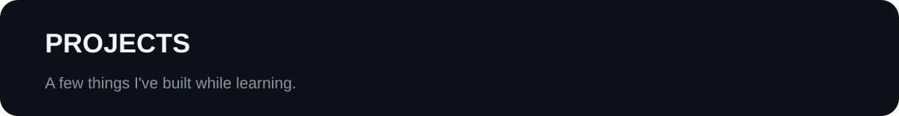
<a href="https://github.com/ma10-yt/AR-Writing"></a><a href="https://github.com/ma10-yt/ma10-portfolio"></a>
<a href="https://github.com/ma10-yt/friday"></a>

